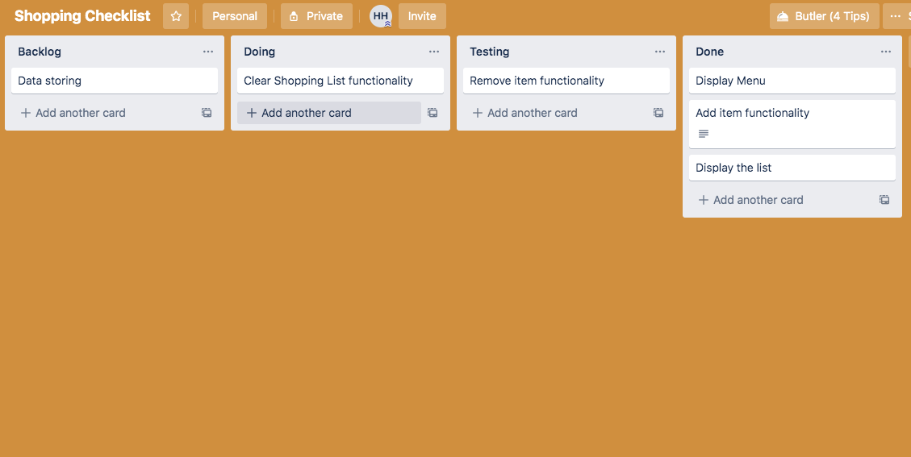
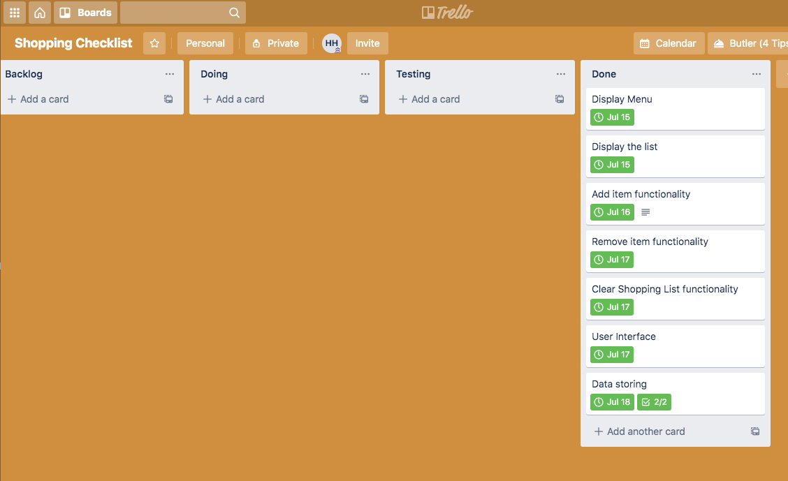

# Terminal Application - Shopping List
***
## Help and Installation Guide

## Software Development Plan
*System Requirement*: Ensure that Python3 is installed on your machine.

Once the application file is downloaded to your computer, Navigate to directory of the main.py file that should be available under *src* folder.

Open terminal and type in bellow command::
>chmod +x main.py 
./main.py

**Options:**
>./main.py --help list all the handle key use to navigate and interact with the application
>./main.py --about give overview of the shopping list application, show all the menu options and quick view on the existing shopping list.

**Notes:**
For best experience run the application on your local machine's terminal. 
A known bug : Ed's terminal acting funny at the begining when application is just executed

#### Application Purpose and Scope

**The Shopping List** is a terminal application that has been deployed for computer users. This application aims to produce a shopping list based on all items that has been inputted by the user. As part of the new normal that make us spend more time in front of computer screen to work and socialise, this is providing a way to take records of our shopping list and store it electronically rather than writing it down on piece of paper where we may misplace or lost it.

Shopping Checklist is developed to provide assistance on taking notes of items that we need to shop while we are sitting in front of computer. The user can quickly add item to the shopping list without leaving the computer. This allows user to maintain their productivity and efficiency while working on computer. The application will function as their electronic notes for shopper, featuring the required functionality to allow them optimise the smoothness and efficiency of their shopping routine.

The target audience for this application will be for any English speaking computer user that is familiar with terminal environment and python programming language. The application has a friendly user interface and will load up all the menu available in the application once executed. It allow user to navigate within the application using the keyboard input.

Functionally, it should take user input and accept any character to add or remove the item from the shopping list depending on which menu the user at when entering their input. For every non-existed item that is given by the user when trying to remove item from the shopping list, it will display a response message that the item is not in exist in the shopping list. Clear the shopping list function should removing all item exist in the shopping list at once. The application will keep running unless the user want to terminate the application by selecting the Exit menu. The application will store all items that has been added by the user and allow user to check their shopping list again when the application is re-accessed.

### Features
##### Friendly User Interface 
The application should have a friendly user interface that is more enhanced than just line by line text controlled programs. It display all the menu available at the center of the screen, highlighted selectable menu and allowing user to navigate using the keyboard input. The curses standard library will be used to implement the user interface. Each menu will have their specific window and it will have title to specify which window the user currently in. Textbox method is utilised to allow user type in some input to the window. This method is used in Add Item and Remove Item menu. Response message will be prompted to the user when necessary to confirm the action. 

#### Intuitive and Easy Navigation
The application is intuitive and easy to navigate. User should be able to interact with the application and data input on Add item and Remove item function. There is also an option to shortcut on emptying the shopping list, Clear Shopping List function. The user can operate and select menu by using keyboard or their mouse except when the system is waiting for user to type in their input. Each menu's window has instruction list on how to navigate just under the window's title. In order to terminate the program, the user can simply select the exit menu.

##### Add Item, Remove Item, Clearing Shopping List
The Add Item and Remove Item, both are using the Textbox function that is available on curses library. On these function, the user is prompt to enter the item(s) name they want to add / remove from the list. User will be able to type in multiple items at once and uses sequences of list to store the user input temporarily, split each item, and sanitised the input by blank space. Add item function will add the temp list element into the existing shopping list. Meanwhile, Remove item function will compare the temp list element with the shopping list element first and if the element is exist in the shopping list it will remove it. Otherwise, a response message will be displayed for telling user that the item is not in the shopping list. Lastly, Clearing shopping list will remove all item in the shopping list in once. If the shopping list is empty, it should notify the user that there is no item to be removed.

##### Storing data
The application should be able to memorise the existing items on shopping list. For instance, when the user run the application for the first time, the shopping list will be empty and then he/she added some items inside the shopping list. Once done, they exit the program. The second time user run the program and want to view their shopping list again, the items should still be displayed. This can be implemented by writing the shopping list items into a text file first when the user select Exit function then only terminate the applcation. At the beginning of the program, the application will read the text file first to be added into the shopping list. Fortunately, python has a built in support to write and read a text file that makes the implementation of this feature seamlessly.

### User Interaction
The application is very intuitive and interactive. Once the application is executed, it will display a window with list of menu opotions available in the application, which user can navigate and the user current position will be highlighted (see below)


If user is on the first option and try to keep moving up, the user should remain selecting the first option, which is View Shopping List will still be highlighted. Similarly, if the user is at the last option which is Exit and try to keep moving down, user position will remain on Exit option.

Selecting particular option can be done by navigating to the particular option user wish to access and press Enter on the keyboard. For each option selected, the program will display title that is highlighted and necessary instruction to each option. 

First time executing the program, the shopping list should be empty. Hence, when you select View Shopping List option, there will be message saying "Your shopping list is currently empty". This message will always be print out whenever the shopping list has no item inside it. This particular case will occur when the application is execute for the first time as it is initialised the shopping list to be empty, user selecting Clear Shopping List option, and user remove the only item in the shopping list using Remove Item from Shopping List option.


On the case the user has executed the application previously and add item(s) to the shopping list then terminate the program, when the user execute the application again and check the shopping list, It should display all of the items that user added previously.

There are three instructions that will be print out on Add Item to Shopping List and View Shopping List options, which are:
```
1. Hit Ctrl+G to save
2. Hit Ctrl+H to delete character backwards
3. Save first and Hit any key to return to main menu
```

If user select Add Item to Shopping List, it will display current shopping list and a line asking user to type in item that they want to add into the list. Each line should only be for one item and user is enable to add multiple items in once. In order to add it to the shopping list, user will need to press Ctrl + G which means save the action. After saving it, a confirmation message will display "The item(s) has been added to the shopping list"


All input that user type in will be sanitised to make it display in uniform format and easier to read. Therefore, when user select the View Shopping List again, all the items will be displayed sequently from first to last item added and the first letter of item is upper case while the rest display in lower case.


Remove Item from Shopping List function is to enable user to remove one or multiple item from the shopping list. Its operation is similar to Add Item to Shopping List. The difference, the program will compare the user input with the shopping list. If the item input by user is not exist in the shopping list, it will raise an exception and print message "The item [item_name] does not exist in the shopping list". In other respect, if the item input is in the shopping list, the program will remove it from shopping list and print confirmation message "The item(s) [item_name] has been removed from the list"


In the case where user does not type in any input, user need to follow instruction number 3 in order to go back to the main menu.

Clear Shopping List option is use when the user wish to empty the shopping list at once. This feature is very useful when the user just completed his / her shopping and successfully bought all the items inside the shopping list. User can simply clear out the shopping list using this option. It will print message "Removing [number of item] items on your shopping list".


If the shopping list is empty and the user select this option, it will print error message "There is no item to be removed. Your shopping list is currently empty"


Lastly, the Exit option is for allowing user to close the application. It will terminate the application when it is selected.

### Control Flow Diagram


### Implementation Plan
There is a time constraint in the process of developing this terminal application. Therefore, I need to be productive and efficient with my time. I have decided to utilise Trello - web based application to create lists. 

Trello allows me to create job board and enable me to add multiple list to help me keep tracks on the items that i need to work on and what is its status. I have sorted my lists into Backlog, Doing, Testing and Done.

Each application's features that I need to implement is recorded as a card. Each card support to add description, due date, and checklist.

On this application development, I started to implement display menu that the function is to printing out all the menu list inside the application at the center of the screen. Ideally, I should start with the user interface implementation as it could make the development process more efficient. However, I encountered a road block with curses library and unable to implement it properly. Therefore, I decided to focus on the functionality element of the application first then worked on the user interface implementation. Following the display menu, I implemented View Shopping List, Add Item to Shopping List, Remove Item to Shopping List, and Clear Shopping List functions continuously. Initially, I planned to have Check Item and Display Total Item functionalities. Due to the time constraints, I decided not to implement those two functions and start to work on the user interface. At the end, I managed to get the user interface to work and added a storing data feature where user will be able to reaccess the pending checking list eventhough they have terminated the application previously.








The features that needs to be developed:
1. User Interface
    - Implementing user interface using curses standard library
    - Displaying all menu options at the center of the application window 
    - Differ the color of user current position at the menu option
    - Enable user to navigate with the arrow key on keyboard
    - Menu selection triggered by hit enter key on keyboard
    - Clear the display once selected a menu and print a title according to the menu selected
    - Return to all menu options by pressing any key on keyboard
2. View Shopping List
    - Print out all the necessary instruction for user to interact
    - Get all the item of shopping list from the demo data 
    - Display the items in a sequential manner and one item per line with number starts from 1, 2, 3, and so on
    - Uniform the format of displaying item
    - Get all the item of shopping list from the user input
    - Display the items in a sequential manner according to the sequence of user input
3. Add Item to Shopping List
    - Print out all the necessary instruction for user to interact
    - Implementation to enable user type in the screen using curses
    - User input one item and add into shopping list
    - User add multiple items in once then add into shopping list
    - Include display current shopping list items
    - Print out confirmation message
4. Remove Item from Shopping List
    - Print out all the necessary instruction for user to interact
    - Implementation to enable user type in the screen using curses
    - User input one item to remove from shopping list
    - User remove multiple items in once then add into shopping list
    - Check if the item from user input is exist in the shopping list
    - Error handling if the item is not exist in shopping list
5. Clear Shopping List
    - Print out all the necessary instruction for user to interact
    - Iterate through the shopping list and remove all of the items
    - Print out confirmation message and inform how many items is being removed
    - Error handling if the shopping list is currently empty
6. Storing Data and Exit
    - Implement function to write into a text file
    - Get all the items exist in shopping list before user terminate the application and write to text file
    - Implement read from text file function
    - Terminate the application

### Testing
Here is the link to the manual testing spreadsheet [Manual Testing]("https://docs.google.com/spreadsheets/d/1e_GlcjlpbD8mdZXLQOeAsO1X-d7fXW3RnyGvaZ_w9aY/edit?usp=sharing")
